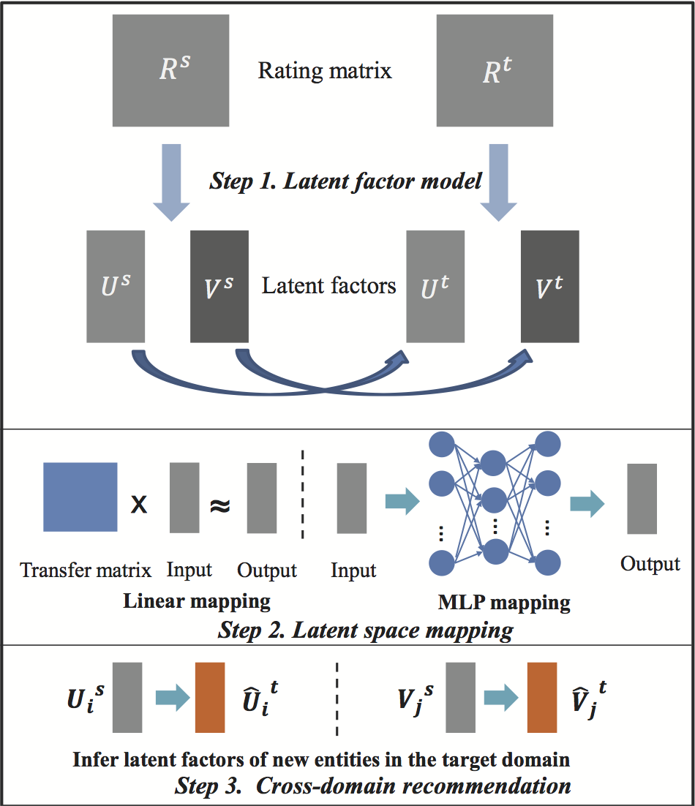

## Cross Domain Recomendation

Recommender system make recommendation for customers based on their history interest. One crucial problem of recommender system is data sparsity. Combine different data sources from different domain is one reasonable way to solve the data sparsity problem.

### Context-Adaptive Matrix Factorization

We present a new recommendation algorithm to combine the users' and items' information from different data sources. 
Based on the classical matrix factorization model, we propose a context-adaptive method for multi-context recommendation via simultaneously modeling context-specific factors and entity-intrinsic factors in a unified model.
We use a Gaussian-mixture model to combine the two information sources, and use a EM (Expectation-Maximization) method to infer the paramters of the model.
We apply the AdaMF method in two real scenarios: an item-aligned scenario where movies receive ratings in MovieLens and Netflix, and a user-aligned scenario where users of Douban give ratings to three types of items, i.e., music, books, and movies. 
Experimental results demonstrate that our method consistently improves the prediction accuracy in both sce- narios on all the sparsity levels.

Tong Man, Huawei Shen, Junming Huang and Xueqi Cheng.
CIKM 2015 (Oral)

### Cross-Domain Recommendation: An Embedding and Mapping Approach

Tong Man, Huawei Shen, Xiaolong Jin and Xueqi Cheng.
IJCAI 2017 (Oral)

### References

1. Context-Adaptive Matrix Factorization for Multi-Context Recommendation 
2. (https://github.com/contact) and we’ll help you sort it out.
3. 
